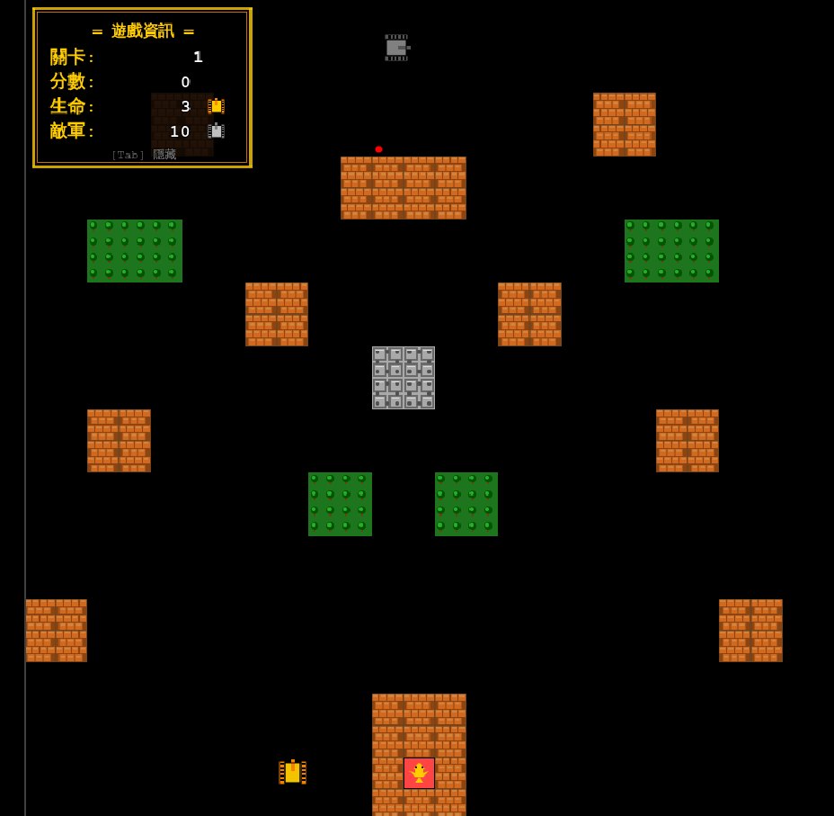

# 🎮 Tank Battle - 經典坦克大戰

> 使用 Phaser.js 3 開發的經典 FC Battle City (1985) 復刻版

**[🎮 線上試玩](https://blue-rubiks.github.io/tank-battle/)** | [English](README_EN.md) | [繁體中文](README.md)

---

## 📖 專案簡介

這是一個完整復刻經典紅白機《坦克大戰》的網頁遊戲，使用現代化的 JavaScript 技術棧開發。遊戲完整實現了原版的所有核心機制，包括 4 級星星升級系統、6 種道具、智能 AI 敵人、多種地形等特性。

## 📸 遊戲截圖

)

## ✨ 核心特性

- 🎯 **完整復刻** - 經典 FC 規則 100% 還原
- ⭐ **升級系統** - 4 級星星升級，永久有效直到死亡
- 🎁 **道具系統** - 6 種經典道具（星星、頭盔、手榴彈等）
- 🤖 **智能 AI** - 4 種狀態機行為 + A* 尋路演算法
- 🗺️ **多樣地形** - 7 種地形類型（磚牆、鋼牆、水域、冰地、森林等）
- 💾 **存檔功能** - 自動保存進度、分數和統計數據
- ✅ **高品質** - 161 個單元測試全部通過

## 🎮 遊戲操作

| 按鍵 | 功能 |
|------|------|
| ⬆️⬇️⬅️➡️ | 移動坦克 |
| `空白鍵` | 射擊 |
| `P` | 暫停/繼續 |
| `Tab` | 顯示/隱藏 UI |

## 🚀 快速開始

### 環境要求

- Node.js 22.x 或更高版本
- npm 10.x 或更高版本

### 安裝與運行

```bash
# 1. 克隆專案
git clone https://github.com/twtrubiks/tank-battle.git
cd tank-battle

# 2. 安裝依賴
npm install

# 3. 啟動開發伺服器
npm run dev
# 遊戲將在 http://localhost:8080 自動開啟

# 4. 執行測試
npm test

# 5. 生產構建
npm run build
```

## 📁 專案結構

```
tank-battle/
├── src/                    # 源代碼
│   ├── scenes/            # 遊戲場景（7 個）
│   ├── entities/          # 遊戲實體（坦克、子彈、地形等）
│   ├── systems/           # 遊戲系統（AI、碰撞等）
│   ├── managers/          # 管理器（音效、存檔）
│   └── utils/             # 工具類（常數、狀態機、A* 演算法）
├── tests/                 # 測試文件（161 個測試）
├── public/                # 靜態資源
│   └── data/             # 關卡數據（5 個關卡）
└── docs/                  # 技術文檔
```

## 🎯 遊戲特性

### 星星升級系統

| 等級 | 效果 |
|------|------|
| ⭐ Lv.1 | 速度 +30% |
| ⭐⭐ Lv.2 | 雙發子彈 |
| ⭐⭐⭐ Lv.3 | 可破壞鋼牆 |
| ⭐⭐⭐⭐ Lv.4 | 3 發子彈 + 5 秒無敵護盾 |

### 道具系統

- ⭐ **星星** - 坦克升級
- 🪖 **頭盔** - 10 秒無敵護盾
- 🎖️ **坦克** - 額外生命 +1
- 🛠️ **鐵鍬** - 基地防護 15 秒
- ⏰ **時鐘** - 冰凍敵人 8 秒
- 💣 **手榴彈** - 消滅所有敵人

### 敵人類型

- **BASIC (灰色)** - 1 HP，慢速，100 分
- **FAST (紅色)** - 1 HP，快速，200 分
- **POWER (黃色)** - 2 HP，中速，300 分
- **ARMOR (綠色)** - 4 HP，慢速，400 分（隨血量變色）

## 🛠️ 技術棧

- **前端框架**: Phaser.js 3.60+
- **語言**: JavaScript ES6+
- **構建工具**: Webpack 5 + Babel
- **測試框架**: Jest
- **代碼規範**: ESLint + Prettier

## 📚 文檔

- [遊戲特性說明](./docs/GAME_FEATURES.md)
- [設計模式詳解](./docs/technical/design-patterns.md)
- [A* 尋路演算法](./docs/technical/astar-pathfinding.md)
- [技術選型說明](./docs/technical/TECH_STACK.md)
- [部署指南](./docs/technical/DEPLOYMENT.md)

## 🧪 測試

專案包含完整的單元測試覆蓋：

```bash
# 執行所有測試
npm test

# 監聽模式
npm run test:watch

# 生成覆蓋率報告
npm test -- --coverage
```

測試統計：
- 測試套件：9 個
- 測試用例：161 個
- 測試代碼：2,493 行
- 通過率：100%

## 🎨 代碼品質

```bash
# 代碼檢查
npm run lint

# 自動修復
npm run lint:fix
```

## 📝 開發指令

```bash
npm run dev        # 開發模式（熱重載）
npm run build      # 生產構建
npm test           # 執行測試
npm run lint       # 代碼檢查
```

## 🤝 貢獻

歡迎提交 Pull Request 或 Issue！

1. Fork 本專案
2. 創建你的特性分支 (`git checkout -b feature/AmazingFeature`)
3. 提交你的更改 (`git commit -m 'Add some AmazingFeature'`)
4. 推送到分支 (`git push origin feature/AmazingFeature`)
5. 開啟 Pull Request

## 📄 授權

本專案採用 MIT 授權 - 詳見 [LICENSE](LICENSE) 文件

## 👨‍💻 作者

**twtrubiks**

- GitHub: [@twtrubiks](https://github.com/twtrubiks)

## 🙏 致謝

- 靈感來源：經典 FC 遊戲《Battle City》(1985)
- 遊戲引擎：[Phaser.js](https://phaser.io/)

---

⭐ 如果你喜歡這個專案，請給它一個 star！
