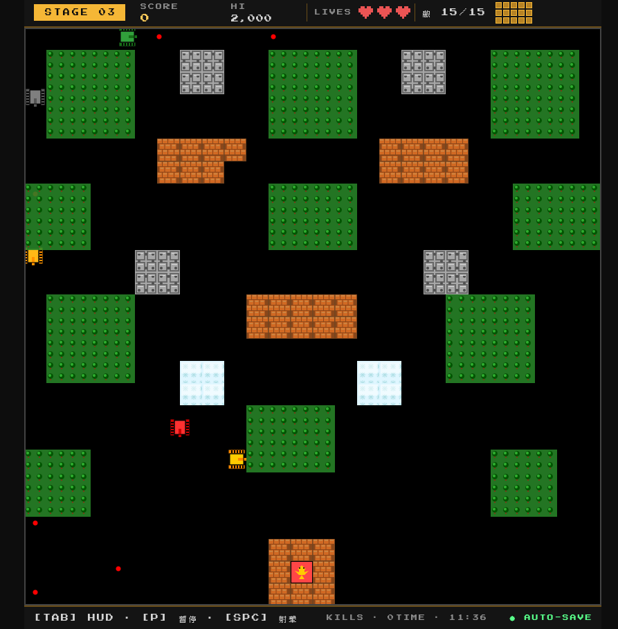

# 🎮 Tank Battle - Classic Tank Battle Game

> A faithful recreation of the classic FC Battle City (1985) using Phaser.js 4

[](https://phaser.io/)
[](https://nodejs.org/)

**[🎮 Play Online](https://blue-rubiks.github.io/tank-battle/)** | [English](README_EN.md) | [繁體中文](README.md)

---

## 📖 About

A complete remake of the classic NES game "Battle City" (Tank 1990) using modern JavaScript and Phaser.js 4. This project faithfully recreates all core mechanics including the 4-level star upgrade system, 6 power-ups, intelligent AI enemies, and various terrain types.

## 📸 Screenshots

<p align="center">
  
  
</p>

## ✨ Features

- 🎯 **Authentic Recreation** - 100% faithful to FC rules
- ⭐ **Upgrade System** - 4-level star upgrades, persistent until death
- 🎁 **Power-ups** - 6 classic items (Star, Helmet, Grenade, etc.)
- 🤖 **Smart AI** - Advanced AI: predictive shooting, line of sight, flanking, team coordination
- 🗺️ **Diverse Terrain** - 7 terrain types (Brick, Steel, Water, Ice, Forest, etc.)
- 💾 **Save System** - Auto-save progress, scores, and statistics
- ✅ **High Quality** - 206 unit tests, all passing

## 🎮 Controls

| Key | Action |
|-----|--------|
| ⬆️⬇️⬅️➡️ | Move tank |
| `Space` | Shoot |
| `P` | Pause/Resume |
| `Tab` | Toggle UI |

## 🚀 Quick Start

### Prerequisites

- Node.js 24.x or higher
- npm 11.x or higher

### Installation

```bash
# 1. Clone the repository
git clone https://github.com/twtrubiks/tank-battle.git
cd tank-battle

# 2. Install dependencies
npm install

# 3. Start development server
npm run dev
# Game will open at http://localhost:8080

# 4. Run tests
npm test

# 5. Build for production
npm run build
```

## 📁 Project Structure

```
tank-battle/
├── src/                    # Source code
│   ├── scenes/            # Game scenes (7 scenes)
│   ├── entities/          # Game entities (tanks, bullets, terrain, etc.)
│   ├── systems/           # Game systems (AI, collision, etc.)
│   ├── managers/          # Managers (audio, save)
│   └── utils/             # Utilities (constants, state machine, A* algorithm)
├── tests/                 # Test files (206 tests)
├── public/                # Static assets
│   └── data/             # Level data (5 levels)
└── docs/                  # Technical documentation
```

## 🎯 Game Features

### Star Upgrade System

| Level | Effect |
|-------|--------|
| ⭐ Lv.1 | Speed +30% |
| ⭐⭐ Lv.2 | Double bullets |
| ⭐⭐⭐ Lv.3 | Can destroy steel walls |
| ⭐⭐⭐⭐ Lv.4 | 3 bullets + 5-second invincibility |

### Power-ups

- ⭐ **Star** - Tank upgrade
- 🪖 **Helmet** - 10-second invincibility shield
- 🎖️ **Tank** - Extra life +1
- 🛠️ **Shovel** - Base protection for 15 seconds
- ⏰ **Clock** - Freeze enemies for 8 seconds
- 💣 **Grenade** - Destroy all enemies

### Enemy Types

- **BASIC (Gray)** - 1 HP, slow, 100 points
- **FAST (Red)** - 1 HP, fast, 200 points
- **POWER (Yellow)** - 2 HP, medium speed, 300 points
- **ARMOR (Green)** - 4 HP, slow, 400 points (changes color with HP)

## 🛠️ Tech Stack

- **Framework**: Phaser.js 4.1+
- **Language**: JavaScript ES6+
- **Build**: Webpack 5 + Babel
- **Testing**: Jest
- **Linting**: ESLint + Prettier

## 📚 Documentation

- [Game Features](./docs/GAME_FEATURES.md)
- [Design Patterns](./docs/technical/design-patterns.md)
- [A* Pathfinding Algorithm](./docs/technical/astar-pathfinding.md)
- [Advanced AI System](./docs/technical/advanced-ai.md)
- [Tech Stack](./docs/technical/TECH_STACK.md)
- [Deployment Guide](./docs/technical/DEPLOYMENT.md)

## 🧪 Testing

The project includes comprehensive unit test coverage:

```bash
# Run all tests
npm test

# Watch mode
npm run test:watch

# Coverage report
npm test -- --coverage
```

Test Statistics:
- Test Suites: 11
- Test Cases: 206
- Test Code: 3,347 lines
- Pass Rate: 100%

## 🎨 Code Quality

```bash
# Lint code
npm run lint

# Auto-fix
npm run lint:fix
```

## 📝 Development Commands

```bash
npm run dev        # Development mode (hot reload)
npm run build      # Production build
npm test           # Run tests
npm run lint       # Lint code
```

## 🤝 Contributing

Contributions are welcome! Please feel free to submit a Pull Request.

1. Fork the project
2. Create your feature branch (`git checkout -b feature/AmazingFeature`)
3. Commit your changes (`git commit -m 'Add some AmazingFeature'`)
4. Push to the branch (`git push origin feature/AmazingFeature`)
5. Open a Pull Request

## 📄 License

This project is licensed under the MIT License - see the [LICENSE](LICENSE) file for details.

## 👨‍💻 Author

**twtrubiks**

- GitHub: [@twtrubiks](https://github.com/twtrubiks)

## 🙏 Acknowledgments

- Inspired by: Classic NES game "Battle City" (1985)
- Game Engine: [Phaser.js](https://phaser.io/)

---

⭐ If you like this project, please give it a star!
